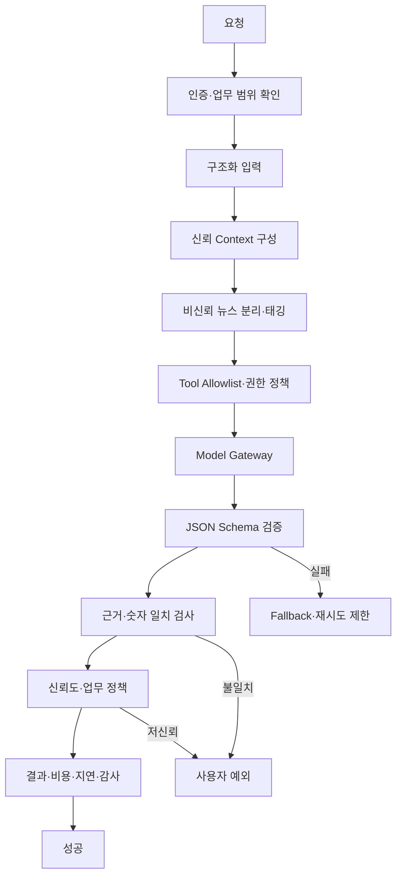

# AI Agent Harness

## 목표와 비목표

AI는 뉴스·운영 데이터를 설명하고 반복 업무를 자동화한다. 정확한 금융 계산, 정책 판정, Order Intent 생성, 브로커 주문 본문 작성은 AI의 책임이 아니다.

### 목표

- 뉴스 요약·감성·사건 유형·심각도·종목·섹터 관련성 분석
- 추천 등급과 근거 생성
- 주문 차단 이유와 사용자 예외 설명
- 파이프라인 장애·과거 Runbook 요약
- 검증된 일간·주간 보고서 작성
- 자연어 기반 계좌·포지션·주문·성과 조회
- 모델·Prompt 성능, 비용, 지연의 지속 평가

### 비목표

- 자유 SQL 또는 셸 실행
- 기사 속 지시 실행
- 종목·가격·수량을 지정하는 주문 호출
- 정책 생성·수정·승인·활성화
- Semantic Layer와 무관한 숫자 재계산

## Harness 흐름



## Agent 상태

```text
RECEIVED
CONTEXT_READY
MODEL_RUNNING
OUTPUT_VALIDATING
SUCCEEDED
LOW_CONFIDENCE
FAILED
ESCALATED
CANCELED
```

모든 상태 전이에는 `agent_run_id`, correlation/trace ID, model·prompt·tool version, 시작·종료 시각, Token·비용, 오류와 Fallback을 기록한다.

## Context 구성

Context는 다음 신뢰 계층을 명시적으로 분리한다.

1. System Policy와 Tool Policy
2. 승인된 운영 매뉴얼·Runbook
3. Semantic Layer의 검증된 Metric
4. 데이터 Mart와 내부 객체 Snapshot
5. 비신뢰 외부 뉴스·사용자 입력

뉴스 원문은 지시문이 아니라 분석 대상 데이터로만 직렬화한다. 뉴스 속 URL, 코드, 명령, Prompt가 Tool 인자나 시스템 메시지로 사용되어서는 안 된다.

## Tool Allowlist

초기 허용 도구는 ID 기반의 제한된 인터페이스다.

| Tool | 권한 | 제약 |
|---|---|---|
| `get_account_summary()` | 읽기 | 마스킹된 요약·Semantic Metric만 |
| `get_positions()` | 읽기 | Allowlisted 필드, 페이지 제한 |
| `get_market_status()` | 읽기 | 내부·브로커 관측 시각 함께 반환 |
| `get_risk_status()` | 읽기 | 정책 상태·차단 사유, Secret 제외 |
| `get_recommendation(id)` | 읽기 | 내부 ID 필수 |
| `get_order_intent(id)` | 읽기 | 실행 Credential·원본 Header 제외 |
| `get_pipeline_status(run_id)` | 읽기 | 자유 SQL 불가 |
| `create_report(request_id)` | 쓰기 제한 | 사전 생성된 요청만 처리 |
| `pause_automated_trading(reason)` | 위험 감소 | Scope·사유·감사, 자동 재개 불가 |

초기에는 `submit_approved_order`도 허용하지 않는다. 승인형 거래 단계에서 검토하더라도 사용자 승인과 1회성 capability가 있는 `order_intent_id`만 받고 주문 속성을 변경할 수 없어야 한다.

다음 도구는 금지한다.

```text
place_order(symbol, side, quantity, price)
execute_sql(free_form_sql)
execute_shell(free_form_command)
fetch_url(arbitrary_url)
change_policy(...)
read_secret(...)
```

## 구조화 입력과 출력

입력에는 업무 목적, Snapshot ID, 분석 기준 시각, 허용 Tool, Context 버전, 데이터 최신성·품질을 포함한다.

뉴스 분석 출력 후보는 다음과 같다.

```text
article_id
instrument_links[]
sentiment
event_type
severity
relevance
freshness
source_credibility
cross_source_confirmation
evidence_locations[]
confidence
risk_signal
model_version
prompt_version
```

추천 출력 후보는 다음과 같다.

```text
recommendation_id
instrument_id
grade: STRONG_SELL / SELL / NEUTRAL / BUY / STRONG_BUY
rationale[]
price_volume_evidence[]
news_evidence[]
risk_factors[]
confidence
analysis_as_of
strategy_version
policy_version
model_version
prompt_version
evidence_ids[]
```

추천에는 Order Side·Quantity·Price가 포함되지 않는다.

## 뉴스 위험 신호

출처 공신력과 사건 위험도를 분리한다. AI는 원자 요소를 분류할 수 있지만 최종 합성 공식은 버전이 있는 코드가 계산한다.

```text
source_credibility
× instrument_relevance
× event_severity
× freshness
× cross_source_confirmation
= versioned_news_risk_signal
```

곱셈식과 가중치·정규화는 개념 초안이며 평가 데이터로 보정하기 전에는 `TBD`다.

## Prompt Injection 방어

- 외부 본문을 `UNTRUSTED_DATA`로 태깅한다.
- Tool 인자는 Harness가 발급한 내부 ID만 허용한다.
- 뉴스에서 추출한 문자열을 Tool 이름이나 권한으로 승격하지 않는다.
- 모델의 네트워크·파일·셸 접근을 차단한다.
- 출력 JSON Schema, 길이, Enum, 숫자 범위를 검증한다.
- Evidence ID가 실제 제공 Context에 존재하는지 검사한다.
- 숫자는 Semantic API 결과와 일치하는지 비교한다.
- Context 크기·기사 수·도구 호출 수·재시도 수에 한도를 둔다.
- 모델 결과가 실패해도 Tool 권한을 확대하지 않는다.

## 실패와 Fallback

| 실패 | Fallback |
|---|---|
| JSON Schema 실패 | 제한된 1회 복구 또는 실패 종료 |
| 낮은 신뢰도 | 거래 의존 경로 차단, 사용자 예외 |
| Provider Timeout·장애 | 대체 Provider 후보 또는 결정론적 템플릿 |
| 근거 불일치 | 결과 폐기·평가 실패 기록 |
| 보고서 설명 실패 | 검증 수치의 정적 표 보고서 |
| Prompt Injection 탐지 | Tool 호출 없이 격리·보안 이벤트 |
| 비용·지연 한도 초과 | 요청 중단·축약 Context·배치 전환 |

AI 실패가 해당 AI 결과에 의존하지 않는 결정론적 거래까지 자동 차단하지 않는다. 의존 관계를 정책에 명시한다.

## 평가와 승격

평가 Dataset은 기사·종목 링크, 사건 유형, 심각도, 뉴스 위험, 근거 위치, 구조화 출력, 차단 이유 설명, 장애 요약을 포함한다.

최소 Metric은 다음과 같다.

- 뉴스와 종목 연결 Precision·Recall·F1
- 사건 유형·심각도·위험도 정확도
- 추천 근거의 원천 일치율
- 근거 없는 주장 비율
- 구조화 출력 성공률
- 저신뢰 결과 비율과 사용자 예외 전환율
- Prompt Injection 공격 성공률
- 응답 p50/p95/p99
- 요청당 Token·비용
- 모델·Prompt 버전별 성능

새 모델·Prompt는 고정 Dataset과 Replay에서 기존 버전을 통계적으로 비교하고 기준 미달 시 승격하지 않는다. 초기에는 AI의 실제 주문 영향도를 0으로 두고 Shadow 평가한다.

## 보고서

AI는 숫자를 임의 계산하지 않는다. Semantic Layer와 Mart에서 다음을 조회해 설명한다.

- 시작·종료 자산, 실현·미실현손익, 수익률
- 수수료·세금·환율 영향
- 전략 신호·추천 분포
- 주문·체결·미체결·취소·정책 차단
- 종목·섹터 노출
- 뉴스 위험 사건
- 데이터 품질·파이프라인·AI 실패
- 사용자 확인 예외
- 전략·정책·모델·Prompt 버전

모든 보고서는 사용한 Mart Snapshot과 Metric Version을 기록한다.
