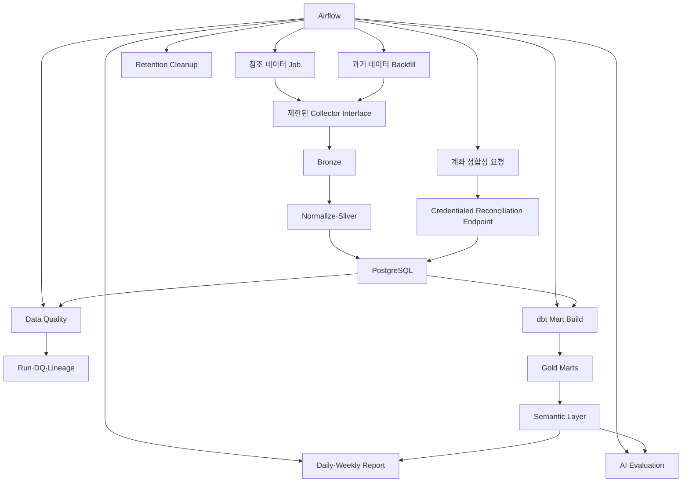

# 전체 아키텍처

## 결정

`CONFIRMED` 구조는 **Java 모듈러 Trading Core + 격리된 Java Order Executor + Python Intelligence + 데이터 플랫폼**으로 구성한 소수의 독립 서비스다.

전면 마이크로서비스는 현재 사용 인력과 4 vCPU·7.8 GiB 개발 서버에 과도하다. 단일 모놀리스는 운영은 단순하지만 Broker Credential과 Python AI 경계를 충분히 격리하기 어렵다. 따라서 도메인은 모듈러하게 유지하고 실제 배포 단위는 실패·권한 경계가 필요한 곳에만 둔다.

근거는 [ADR-0001](adr/0001-system-boundaries.md)에 기록한다.

## 핵심 구성요소

| 구성요소 | 언어 | 책임 | 금지 사항 |
|---|---|---|---|
| Market Collector | Java | 공식 시세 REST 폴링, checkpoint, Rate Limit, 원본 이벤트 | 주문·계좌 권한 |
| Trading Core | Java | 전략 수신, 정책·리스크, Candidate/Intent, 계좌 정합성, 운영 API | Broker Credential 접근 |
| Order Executor | Java | 인증, 주문·정정·취소·조회, 주문 상태 복구 | AI 판단, 자유 형식 주문 입력 |
| News Collector | Python | 정식 공급자 뉴스 수집, 원본 보관, 중복 후보 생성 | 비공식 무단 수집 |
| Intelligence Service | Python | 뉴스 분석, 추천 근거, Agent Harness, 보고서 설명 | 직접 주문, 자유 SQL·셸 |
| Batch Platform | Python/SQL | Airflow 백필·DQ·Mart·평가·보고서 오케스트레이션 | Tick 처리, Broker Credential 보유 |
| Query/Admin API | Java 또는 별도 얇은 UI 계층 | 조회, 사용자 예외, 정책 변경 Workflow, Kill 제어 | Broker 요청 본문 직접 구성 |
| Dashboard | TBD | 거래·품질·운영 상태 시각화 | 운영 DB 쓰기, 주문 Credential |

## 실시간 데이터 흐름

```mermaid
flowchart LR
    TMD["Toss Market REST"] --> MC["Market Collector"]
    NEWS["Licensed News API"] --> NC["News Collector"]

    MC --> MR["market.raw.v1"]
    NC --> NR["news.raw.v1"]
    MR --> RAW["Bronze Object Storage"]
    NR --> RAW

    MR --> MV["시장 검증·정규화"]
    NR --> NV["뉴스 정규화·중복 제거"]
    MV --> MN["market.normalized.v1"]
    NV --> NN["news.normalized.v1"]

    MN --> FE["실시간 특징 계산"]
    NN --> AI["AI News Analysis Harness"]
    FE --> FT["feature.calculated.v1"]
    AI --> NA["news.analysis.v1"]

    FT --> ST["결정론적 전략"]
    NA --> REC["추천·뉴스 위험 신호"]
    ST --> SG["strategy.signal.v1"]
    REC --> RG["recommendation.generated.v1"]

    SG --> CORE["Trading Core"]
    RG --> CORE
    CORE --> PR["정책·리스크 엔진"]
    PR -->|승인| OI["Reservation + Order Intent + Outbox"]
    PR -->|거절·불명| EX["예외·감사"]

    OI --> OT["order.intent.v1<br/>key=account_id"]
    OT --> OE["Isolated Order Executor"]
    OE --> TORD["Toss Order REST"]
    TORD --> OP["주문 상태 Poller"]
    OP --> OL["order.lifecycle.v1"]
    OL --> RC["Reconciliation"]
    RC --> PG["PostgreSQL"]
    PG --> MART["Gold Mart·Semantic Layer"]
    MART --> DASH["Dashboard·Report·Agent Tools"]
```



초기 Toss 연동은 REST다. 공식 WebSocket 지원이 확인되기 전까지 다이어그램이나 포트폴리오에서 Tick Stream으로 과장하지 않는다.

## 배치 데이터 흐름



Airflow는 외부 수집 로직의 소유자가 아니라 수집 Job을 오케스트레이션한다. 계속 실행되는 실시간 처리는 Kafka Consumer가 담당한다.

## 서비스 간 통신 원칙

- 비동기 업무 이벤트는 Kafka를 사용한다.
- Transactional Outbox로 DB 변경과 발행 의도를 같은 트랜잭션에 기록한다.
- Consumer는 Inbox 또는 처리 이력으로 멱등성을 확보한다.
- 주문 제출 명령은 `Trading Core Outbox → order.intent.v1 → Executor Inbox` 단일 경로만 사용한다. 별도 Dispatcher나 다른 주문 제출 Topic을 두지 않는다.
- `order.intent.v1`은 `account_id`로 Partition하여 계좌 내 전달 순서를 보조하되, 동시 주문의 자금·수량·노출 한도는 PostgreSQL의 계좌 단위 예약과 트랜잭션이 최종 보장한다.
- Kill Switch, 취소, 모호한 주문 상태 조회는 Kafka에만 의존하지 않는다.
- AI Tool과 Admin API는 자유 형식 명령 대신 내부 ID 기반의 제한된 HTTP 인터페이스를 사용한다.
- 서비스마다 DB Schema·Role과 쓰기 소유권을 정한다. 여러 서비스가 같은 업무 테이블을 임의로 수정하지 않는다.

전달 보장 결정은 [ADR-0002](adr/0002-delivery-semantics.md)를 따른다.
계좌 단위 예약과 단일 주문 제출 경로는 [ADR-0004](adr/0004-account-reservation-and-submit-path.md)를 따른다.

## Java와 Python 경계

### Java

- 금액·수량·비중 계산
- 정책·리스크 최종 판정
- Order Candidate/Intent, 계좌 단위 예약과 주문 상태 머신
- Order Executor와 Broker Adapter
- 계좌·주문 Reconciliation
- 안전 중요 Kafka Consumer와 내부 운영 API

### Python

- 뉴스 NLP·LLM 분석
- AI Agent Harness와 평가
- 탐색 분석·백테스트·보고서 설명
- Airflow DAG와 데이터 처리 실험
- 합성 데이터·평가 데이터셋 관리

Python이 금융 수치를 취급할 때도 `Decimal`을 사용한다. 보고서 수치는 Python이 재계산하지 않고 Semantic Layer에서 조회한다.

## 데이터 저장소 역할

| 저장소 | 역할 | 하지 않는 역할 |
|---|---|---|
| PostgreSQL | 주문·체결 관측·계좌·정책·예약·감사·메타데이터·초기 Mart | 고용량 원본 무기한 저장 |
| Kafka | 실시간 전달, Consumer 분리, 제한된 Replay | 영구 감사 저장소 |
| S3 호환 저장소 | 원본, Replay, 백업·감사 Export | 낮은 지연 트랜잭션 |
| Redis | 다중 인스턴스 캐시·Rate Limit 후보 | 주문 정합성 Source of Truth |

Redis는 `LATER`다. 초기 단일 인스턴스에서는 PostgreSQL 제약조건과 로컬 캐시를 우선한다.

## 개발 배포 프로필

현재 서버에서는 모든 도구를 동시에 상시 실행하지 않는다.

| Compose Profile | 구성 후보 | 목적 |
|---|---|---|
| `core` | Kafka, PostgreSQL, Schema Registry, 핵심 서비스 | 계약·실시간 흐름 |
| `batch` | PostgreSQL, Object Storage, Airflow, dbt | 백필·Mart |
| `observability` | Prometheus, Grafana, OTel Collector | 계측·대시보드 |
| `ai-eval` | Intelligence, Mock LLM 또는 승인된 Provider | 평가·보고서 |

실운영은 개발 서버와 분리한다. 단일 Kafka·PostgreSQL·디스크 구성은 고가용성이 아니다.

## 권장 저장소 구조

```text
apps/
  market-collector/
  trading-core/
  order-executor/
  news-collector/
  intelligence-service/
platform/
  airflow/
  dbt/
  schemas/
contracts/
  events/
  internal-api/
  broker-adapter/
libs/
  java-domain/
  java-test-support/
  python-contracts/
  python-evaluation/
infra/
  compose/
  monitoring/
tests/
  contract/
  replay/
  load/
  failure-injection/
fixtures/
  synthetic/
docs/
  adr/
```

이 구조는 다음 구현 단계의 제안이며 아직 생성하지 않는다.
