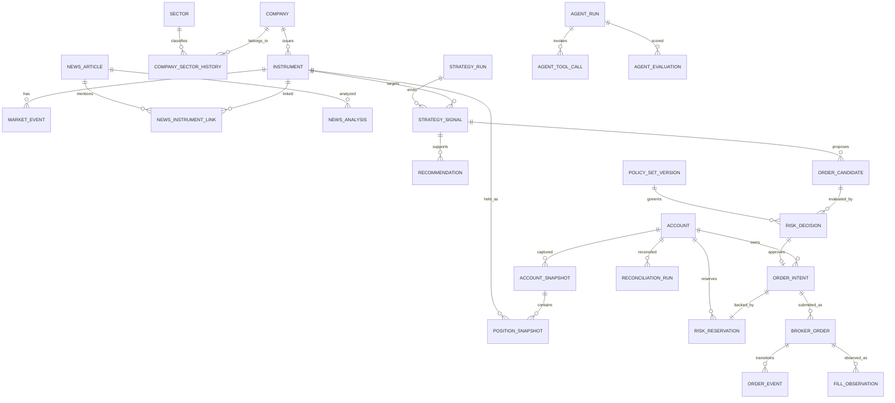

# 데이터 아키텍처

## 목표

- 실시간과 배치 처리의 역할을 분리한다.
- 외부 원본에서 Mart와 주문까지 재현 가능한 Lineage를 유지한다.
- At-Least-Once 전달에서도 중복 주문과 중복 적재를 방지한다.
- AI, Dashboard, 보고서가 같은 지표 정의를 사용한다.
- 실제 규모와 합성 부하 결과를 구분한다.

## 논리적 데이터 계층

| 계층 | 내용 | 저장 후보 | 원칙 |
|---|---|---|---|
| Raw/Bronze | 외부 시세·뉴스·주문·계좌 원본, 수집 메타데이터 | S3 호환 Object Storage | append-only, checksum, 재처리 가능 |
| Normalized/Silver | 표준 종목·시세·뉴스·주문·체결 관측, 단위·시간대 통일 | PostgreSQL, 필요 시 Parquet | DQ 통과, 외부 Schema와 분리 |
| Mart/Gold | 성과·노출·위험·실행·품질·AI 평가 | PostgreSQL+dbt | 업무 Grain·Metric 고정 |
| Semantic Layer | 업무 용어·공식·필터·소유자·버전 | dbt/SQL 정의와 Registry 문서 | AI·Dashboard·보고서 공유 |

Kafka는 데이터 계층의 영구 저장소가 아니라 제한된 기간의 이벤트 전달·분리·Replay 채널이다.

## 공통 이벤트 Envelope

모든 이벤트는 다음 공통 필드를 가진다.

```text
event_id
event_type
schema_version
aggregate_id
correlation_id
causation_id
trace_id
source
source_timestamp
ingested_at
produced_at
pipeline_run_id
replay_flag
checksum
payload
```

적용되는 이벤트에는 다음을 추가한다.

```text
strategy_run_id
strategy_version
recommendation_id
model_version
prompt_version
policy_set_version
order_candidate_id
risk_reservation_id
order_intent_id
broker_request_id
```

규칙은 다음과 같다.

- 금액·가격·수량·비율은 binary float가 아닌 Decimal 형식으로 전달한다.
- UTC 정규화 시각과 원본 offset·거래소 시간대·거래일을 함께 보존한다.
- `event_id`는 이벤트 인스턴스, `aggregate_id`는 업무 객체를 식별한다.
- Replay는 원본 ID 또는 `original_event_id`를 연결하고 `replay_flag`를 표시한다.
- Consumer는 `event_id`와 업무 중복 키를 Inbox에 기록한다.
- 알 수 없는 Enum은 계약상 허용하되 주문 경로에서는 명시적으로 차단·격리한다.

`CONFIRMED` 1단계 구현은 Java/Python 언어 내부 `EventEnvelope`로 필수 식별자·버전·UTC 시각 불변식만 검증한다. 이는 Kafka wire Schema가 아니며 Avro/Protobuf 선택은 계속 `TBD`다.

## 이벤트 Schema

`RECOMMENDED` 초기 선택은 Avro와 Schema Registry다. 이유는 Kafka 중심 이벤트 진화와 Decimal logical type, Java·Python 호환성이다. Protobuf는 생성 코드가 강점이지만 Decimal을 별도 메시지로 정의해야 한다.

최종 선택은 작은 PoC와 ADR로 확정한다.

호환성 정책 후보는 다음과 같다.

- 기본은 Backward-compatible 변경
- 필수 필드 삭제·타입 변경 금지
- 새 Enum을 받는 Consumer는 unknown 값을 허용
- 안전 중요 Consumer는 unknown 값을 Fail-Closed 처리
- Schema 변경 PR에 Producer·Consumer Contract Test 추가
- 배포 전에 Registry 호환성 검사
- 공식 외부 OAS와 내부 이벤트 Schema를 직접 결합하지 않고 Adapter에서 변환

## Kafka Topic 초안

| Topic | Key | Producer | Consumer | 초기 보존 | Replay 원칙 |
|---|---|---|---|---|---|
| `market.raw.v1` | `market:symbol` | Market Collector | Archiver, Validator | 1~3일 | Bronze 원본에서 재생 |
| `market.normalized.v1` | `market:symbol` | Validator | Feature, DQ | 3~7일 | 결정론적 재정규화 |
| `market.quality-failed.v1` | 원본 key | Validator | DQ, 운영 | 30일 | 수정 후 수동 Replay |
| `news.raw.v1` | provider ID/hash | News Collector | Archiver, Normalizer | 계약 내 3~7일 | 라이선스 허용 시만 |
| `news.normalized.v1` | `article_id` | Normalizer | Entity Linker, AI | 30일 | 모델별 재분석 |
| `news.analysis.v1` | `article_id:symbol` | Intelligence | Recommendation, Mart | 90일 | 새 버전 이벤트 추가 |
| `feature.calculated.v1` | `market:symbol` | Feature Worker | Strategy | 7~30일 | 시장 원본으로 재계산 |
| `strategy.signal.v1` | `strategy_id:symbol` | Strategy | Trading Core, Mart | 90일 | 새 `strategy_run_id` |
| `recommendation.generated.v1` | `symbol` | Intelligence | Core, Mart | 90일 | 이전 결과 불변 |
| `risk.decision.v1` | `order_candidate_id` | Core Outbox | Audit, Mart | 90일 | 거래 재실행 금지 |
| `order.intent.v1` | `account_id` | Core Outbox | Executor | 30일 | 자동 Replay·다른 Topic 재발행 금지 |
| `order.lifecycle.v1` | `order_intent_id` | Executor/Poller | Core, Mart, Reconciler | 90일 | 브로커 조회로 재구성 |
| `account.snapshot.v1` | `account_id` | Executor | Reconciler, Risk | 30일 | 새 Snapshot 비교 |
| `reconciliation.result.v1` | `account_id` | Reconciler | Core, Alert | 90일 | 멱등 실행 가능 |
| `control.trading-state.v1` | Scope ID | Admin Control | Core, Executor | Compacted | STOP 자동 해제 금지 |
| `ops.exception.v1` | Exception ID | 모든 서비스 | Alert, Dashboard | 90일 | 상태 변경 이벤트 추가 |
| 도메인별 `*.dlq.v1` | 원본 key | Consumer | 운영자 | 30일 | 주문 자동 Replay 금지 |

보존 기간은 현재 디스크 70 GiB의 실제 증가율과 뉴스 라이선스를 측정한 뒤 조정한다.

주문 제출의 권위 있는 경로는 `Core Outbox → order.intent.v1 → Executor Inbox` 하나다. `order_intent_id`는 Payload와 Inbox의 업무 멱등 키로 사용하고, `account_id` Key는 계좌 내 전달 순서를 보조한다. 별도 Dispatcher와 두 번째 제출 Topic은 두지 않는다.

## 전달·처리 보장

- Kafka 처리 의미는 At-Least-Once를 기본으로 한다.
- DB 상태 변경과 발행 의도는 Transactional Outbox로 묶는다.
- Consumer Inbox와 Unique Constraint로 동일 이벤트 재처리를 멱등하게 만든다.
- Kafka Transaction을 사용하더라도 브로커 REST 호출까지 Exactly-Once라고 주장하지 않는다.
- 주문 DLQ는 자동 Replay하지 않는다. 먼저 내부·브로커 상태를 조회한다.
- Replay 환경은 운영 Topic·계좌·Credential과 물리적 또는 논리적으로 분리한다.
- 같은 계좌의 동시 Risk 승인은 PostgreSQL의 계좌 단위 잠금·Version 검사와 `risk_reservation`으로 직렬화한다. Kafka Partition만으로 자금·수량·노출 한도를 보장하지 않는다.

## 데이터 품질

최소 검사 범위는 다음과 같다.

| 범주 | 규칙 |
|---|---|
| Schema | 필수 필드, 타입, Enum, 버전, 파괴적 변경 |
| 시간 | 미래 시각, 오래된 데이터, 순서 역전, 지연 도착, 거래일 불일치 |
| 중복·누락 | event ID, source ID, checksum, 예정 Poll slot, Sequence/Gap |
| 시장 | 음수·0 가격, 비정상 가격·거래량, 호가 관계, 통화·단위 |
| 종목 | symbol→instrument 매핑, 상장 상태, 거래 중단·코드 변경 |
| 뉴스 | 동일 ID, URL hash, 유사 기사, 발행/수집 시각, 잘못된 종목 연결 |
| 계좌 | 현금·포지션·미체결 주문·활성 예약·체결 합계 대사 |
| 파이프라인 | 입력·출력 건수, 실패·재시도, Schema·코드 버전 |

DQ 결과는 단순 성공/실패 외에 `PASS`, `WARN`, `FAIL`, `QUARANTINED`로 기록한다. 주문 입력에 필요한 데이터의 `WARN` 허용 여부는 정책으로 명시하며, 불명확하면 차단한다.

REST 기반 시장 데이터 완전성은 거래소 전체 Tick 대비가 아니라 예정된 수집 슬롯 대비 성공률로 정의한다.

## 파이프라인 메타데이터

```text
job_name / job_version / run_id
input_dataset / output_dataset
started_at / ended_at
input_count / output_count / failed_count
retry_count
data_quality_result
code_version / schema_version
replay_or_backfill
range_start / range_end
parent_run_id
lineage
```

OpenLineage 같은 제품 도입은 `LATER`지만 위 필드는 초기부터 수집한다.

## Airflow DAG 초안

| DAG | 역할 | 주기·트리거 | 안전 동작 |
|---|---|---|---|
| `reference_data_sync` | 종목·시장·캘린더·환율 | 장 전·일별 | 실패 시 마지막 정상 버전, 신규 거래 검토 |
| `market_candle_backfill` | 누락 1분·일봉 백필 | 요청형 | 범위·Rate Limit·원천 기록 |
| `raw_archive_verify` | Kafka→Object 건수/checksum | 시간별 | 원본 불완전 표시 |
| `daily_data_quality` | 완전성·중복·매핑 검사 | 일별 | Gold 발행 중단 |
| `account_reconciliation` | 내부와 브로커 비교 | 장 전·장 후·요청형 | Executor 제한 API 사용, 불일치 시 주문 중단 |
| `build_intraday_marts` | 포지션·노출·실행 Mart | 5~15분 | 마지막 정상 Mart 시각 표시 |
| `build_daily_marts` | 성과·품질 Mart | 장 종료 후 | 보고서 생성 중단 |
| `daily_report` | 일간 보고서 | Mart 성공 후 | AI 실패 시 정적 템플릿 |
| `weekly_report` | 주간 요약 | 주간 | 숫자 재계산 금지 |
| `agent_evaluation` | 모델·Prompt 회귀 평가 | 변경·주간 | 기준 미달 승격 금지 |
| `replay_dataset_build` | 익명화·합성 Replay Set | 요청형 | 운영 데이터 오염 방지 |
| `retention_cleanup` | 라이선스·보존 정책 | 일별 | 삭제 감사 기록 |
| `backup_restore_check` | 백업·복구 검증 | 주기적 | 운영 승격 차단 |

Airflow가 Broker Credential을 직접 보유하지 않는다. Reconciliation은 Credentialed Executor의 제한된 내부 API를 호출한다.

## 주요 데이터 모델



모델링 규칙은 다음과 같다.

- 티커 대신 영구 `instrument_id`를 내부 PK로 쓴다.
- 종목·기업·섹터 관계는 유효 시작·종료 시각을 가진 이력으로 관리한다.
- `Money`는 `amount NUMERIC + currency`다.
- 수량도 `NUMERIC`이며 시장별 scale·호가 단위는 Adapter와 정책에서 검증한다.
- DB 시각은 `timestamptz` UTC, 거래일·거래소 시간대는 별도 필드다.
- 주문 현재 상태와 append-only `order_event`를 함께 유지한다.
- 승인된 Intent는 현금·매도수량·종목·섹터 노출을 나타내는 `risk_reservation`과 연결한다. Decision·Reservation·Intent·Outbox는 같은 트랜잭션에서 생성한다.
- `risk_reservation`은 `ACTIVE`, `PARTIALLY_CONSUMED`, `CONSUMED`, `RELEASED`, `EXPIRED` 상태와 금액·수량·만료·해제 근거를 보존한다. `UNKNOWN` 주문의 예약은 Reconciliation 전 해제하지 않는다.
- 정책·전략·모델·Prompt·Schema는 새 버전을 추가하고 과거 기록을 덮어쓰지 않는다.
- Outbox·Inbox·Processing Attempt에 Unique Constraint와 처리 시각을 둔다.

## 데이터 Mart

| Mart | 목적·Grain | 주요 Dimension·Metric | 갱신 | 품질·재처리 | 소비자·초기 보존 |
|---|---|---|---|---|---|
| `mart_portfolio_daily` | 계좌×거래일×기준통화 | 시작/종료자산, 현금, 손익, 수익률, MDD | 일별 | 자산 합계 대사, 일자 재빌드 | 보고서·Dashboard, 3년 |
| `mart_trade_performance` | 계좌×전략×종목×closed episode | 총/순손익, 비용, 보유시간, 슬리피지 | 체결 후 | 원가법 검증, episode 재구성 | 전략 평가, 3년 |
| `mart_position_exposure` | 계좌×종목×snapshot time | 평가액, 비중, 미실현손익 | 1~5분 | 합계=계좌 평가액 | Risk·Dashboard, 상세 1년 |
| `mart_sector_exposure` | 계좌×섹터×snapshot time | 섹터 평가액·비중 | 1~5분 | 미분류 비중 검사 | Risk, 상세 1년 |
| `mart_news_risk` | news analysis×종목 | 관련성·심각도·최신성·위험도 | 이벤트 | 기사·종목 근거 존재 | AI·Risk, 계약 연동 |
| `mart_strategy_signal` | signal ID | 방향·점수·Feature Snapshot | 이벤트 | 입력 hash·버전 검사 | 전략 분석, 3년 |
| `mart_recommendation` | recommendation ID×종목 | 등급·신뢰도·위험·근거 | AI 완료 | 근거·버전 필수 | Dashboard·평가, 3년 |
| `mart_risk_decision` | decision ID×policy rule ID | 결과·계산값·한도·차단 사유 | 실시간 | 모든 규칙 결과 존재 | 감사·정책 개선, 프로젝트 수명 |
| `mart_order_execution` | broker order ID | 상태·fill ratio·지연·비용 | 상태 변경 | 상태 전이·수량 합계 | 거래 Dashboard, 프로젝트 수명 |
| `mart_pipeline_quality` | run×dataset×rule | 처리·실패·중복·누락·지연 | Run 종료 | 입력·출력 대사 | 운영·SLO, 1년 |
| `mart_agent_evaluation` | test case×model×prompt×evaluator | 정확도·근거성·지연·비용 | 평가 배치 | 평가셋 버전 필수 | AI 승격, 2년 |

보존 기간은 `TBD`다. 뉴스 계약, 감사 필요, 디스크 증가율과 백업 비용을 확인한 뒤 확정한다.

## Semantic Layer

Semantic Layer는 특정 제품이 아니라 동일한 업무 용어와 계산 규칙을 공유하는 계약이다.

각 Metric은 다음을 필수로 가진다.

```text
name
business_definition
formula
unit
time_basis
inclusions / exclusions
source_models
owner
version
example_usage
```

표준 업무 용어는 종목, 기업, 시장, 섹터, 포지션, 주문, 체결 관측, 실현손익, 미실현손익, 전략 신호, 추천, 정책 판정이다.

| Metric | 정의·공식 요약 | 단위·시간 | 주요 Source |
|---|---|---|---|
| 실현손익 | 매도대금−배분 원가−수수료−세금 | 통화/거래일 | 체결·원가 |
| 미실현손익 | 비용 차감 평가액−잔여 원가 | 통화/시점 | Position·Price |
| 총 평가자산 | 현금+평가액+정의된 미결제자산−부채 | 기준통화/시점 | Account Mart |
| 일간 수익률 | 외부 현금흐름을 분리한 시간가중 수익률 | %/거래일 | Portfolio Mart |
| 누적 수익률 | `product(1+daily_return)-1` | %/기간 | Portfolio Mart |
| 종목 비중 | 종목 평가액/총 평가자산 | %/시점 | Position Mart |
| 섹터 비중 | 섹터 평가액/총 평가자산 | %/시점 | Sector Mart |
| 회전율 | `(매수+매도 절대금액)/(2×평균자산)` | %/기간 | Execution Mart |
| 수수료 비중 | 거래비용/총 체결금액 | %/기간 | Execution Mart |
| 최대 낙폭 | `min(equity/이전 peak−1)` | %/기간 | Portfolio Mart |
| 뉴스 위험도 | 검증된 요소의 결정론적 합성 점수 | 0~100/분석시점 | News Risk Mart |
| 정책 차단 건수 | REJECT·BLOCK 판정 수 | 건/기간 | Risk Mart |
| 주문 성공률 | 브로커 접수/제출 시도 | %/기간 | Execution Mart |
| 주문 완전체결률 | FILLED/접수 주문 | %/기간 | Execution Mart |
| 수량 체결률 | 체결 수량/주문 수량 | %/주문 | Execution Mart |
| 데이터 최신성 | 현재 시각−최신 source timestamp | 초/현재 | Pipeline Mart |
| 데이터 완전성 | 성공 수집 슬롯/예정 슬롯 | %/기간 | Pipeline Mart |
| 중복률 | 중복 이벤트/전체 수신 | %/기간 | Inbox·DQ |
| 파이프라인 성공률 | 성공 Run/종료 Run | %/기간 | Pipeline Mart |
| AI 근거 일치율 | 원천과 일치한 근거 주장/전체 근거 주장 | %/평가셋 | Agent Eval |
| 생산성 개선율 | `(기준시간−자동화후시간)/기준시간` | %/업무 | Productivity Mart 후보 |

원가법, 외부 현금흐름, 미결제자산 포함 범위, 기준 환율은 구현 전에 `TBD`를 해소하고 Broker 값과 대사한다.

## 고급 기술 도입 조건

- Redis: 다중 인스턴스 공유 상태·Rate Limit의 필요성이 측정될 때
- Kafka Streams: 이벤트 시간 Window·Stateful Join이 직접 Consumer보다 유리할 때
- 별도 DW: 분석 쿼리가 운영 PostgreSQL SLO를 반복 위반할 때
- Spark: SQL·Polars 백필이 데이터량과 SLO를 만족하지 못할 때
- GraphDB/RDF: 복잡 관계 탐색이 관계형 모델보다 명확한 이점을 보일 때
- Kubernetes: 다중 호스트, 자동 복구·확장·배포 운영 부담이 Compose 한계를 넘을 때

도입 절차는 문제 측정 → 후보 조사 → 작은 PoC → 기존 방식 비교 → ADR → 도입 후 지표 비교 순서다.
