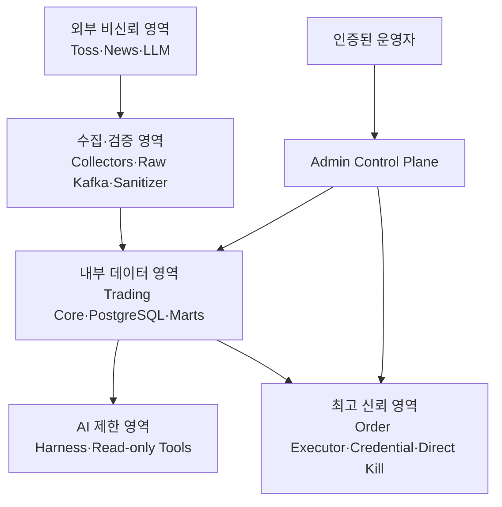

# 보안 및 위험 관리

## 목표

보안 목표는 주문 권한 최소화, 불확실성의 안전한 차단, 비밀정보 격리, 감사 가능성, Prompt Injection과 운영 실수 방지다.

## Trust Boundary

## 권한 경계

| 주체 | 허용 | 금지 |
|---|---|---|
| Market Collector | 시세·시장 정보 조회 | 계좌·주문 |
| Trading Core | 정책·Intent·Reservation·내부 상태 | Broker Credential |
| Order Executor | 제한된 Intent·Reservation 조회와 계좌·주문 API | AI 판단·임의 전략 |
| Airflow | 배치 DB·Object Storage, 제한된 Reconciliation 요청 | Broker Credential |
| Intelligence | 정제 뉴스·Semantic Tool | 주문 API·자유 SQL·셸 |
| Dashboard | 읽기·승인 Workflow·Kill 제어 | DB 직접 쓰기·Credential |

서비스별 DB Role과 Schema 쓰기 소유권을 분리한다. Order Executor는 필요한 Intent·Reservation 조회, Inbox, 주문 상태 기록 범위만 가진다.

Kafka ACL은 `order.intent.v1` Producer를 Trading Core Outbox, Consumer를 Order Executor로 제한한다. Admin API, AI, Airflow와 Dashboard에는 해당 Topic 발행 권한을 주지 않는다.

## 비밀정보

- 실제 Secret을 저장소에 넣지 않는다.
- `.env`는 커밋하지 않고 예시 키만 있는 `.env.example`을 구현 단계에서 제공한다.
- 토큰·계좌번호·개인정보는 로그·Trace·Metric에서 마스킹한다.
- 운영 Secret은 운영 전용 Secret Manager 또는 동등한 방식으로 주입한다.
- 조회 권한과 주문 권한을 공식 API가 분리 지원하는지 구현 전에 확인한다.
- Credential 회전과 폐기, 허용 IP, 토큰 만료 대응을 Runbook으로 관리한다.
- 개발·Shadow·운영 자격증명을 공유하지 않는다.

## 실거래 다중 활성 조건

`live-auto`는 단일 환경변수로 활성화할 수 없다. 최소 다음 조건을 모두 확인한다.

- 명시적 Trading Mode와 운영 전용 환경
- 운영 전용 자격증명과 계좌 Allowlist
- 사용자의 별도 활성화 절차
- Kill Switch 직접 경로와 Stop Latch 정상
- 승인된 정책 세트와 버전
- 최신 데이터와 Data Quality 정상
- 계좌·포지션·미체결 주문 Reconciliation 정상
- Audit Log와 Trace 정상
- 승인된 배포 Artifact와 코드 버전
- 백업·복구·알림 검증
- Limited Auto 단계의 안전 지표 충족

하나라도 실패하거나 확인할 수 없으면 Executor는 `DISARMED` 또는 `PAUSED` 상태를 유지한다.

## Kill Switch 보안

- AI와 Kafka에 독립적인 직접 제어 경로를 둔다.
- 운영자 인증·MFA·재인증을 요구한다.
- STOP은 낮은 지연으로 실행하고 멱등하게 만든다.
- STOP 상태는 재시작 후에도 유지하고 자동 해제하지 않는다.
- 해제는 원인·계좌 정합성·정책·데이터·배포 상태를 재검증한다.
- 취소 요청과 신규 주문 차단을 분리해 기록한다.
- Kill 중 주문 Race를 반복 테스트한다.

## 위협과 통제

| 위협 | 통제 |
|---|---|
| 중복 주문 | Unique Constraint, Outbox/Inbox, 내부 idempotency, Broker 조회 |
| 동시 Intent의 한도 초과 | 계좌 단위 트랜잭션 직렬화, 현금·수량·노출 Reservation, 충돌 시 재평가 |
| 응답 유실 후 재주문 | `UNKNOWN`, 동일 본문·공식 기간 검증 외 자동 재시도 금지 |
| Credential 유출 | Executor 격리, Secret Manager, egress·DB 최소 권한, 마스킹 |
| 정책 우회 | AI·Dashboard와 정책 실행 경로 분리, Executor 재검증 |
| 잘못된 정책 활성화 | Schema 검증, 승인 상태, 충돌 검사, 버전·hash·감사 |
| Prompt Injection | 뉴스 비신뢰 태깅, Tool ID 제한, 자유 도구 금지, 출력 검증 |
| 데이터 오염 | Raw 보존, checksum, DQ, 출처·시각 분리, Replay |
| 수동 앱 주문 | 주기적 계좌·주문 Reconciliation |
| 시간 오차 | UTC 저장, 거래소 시간대, NTP Drift 경보 |
| 관리자 실수 | 다중 Live Gate, 확인 절차, 한도, 감사, 기본 Fail-Closed |
| 공급망 위험 | Dependency lock, SBOM·취약점 검사 후보, 승인된 이미지 |
| 감사 로그 변조 | Append-only DB 기록, Object Storage Export와 hash chain 후보 |

## 뉴스와 LLM 데이터 경계

- 뉴스 원문은 `UNTRUSTED_DATA`로 취급한다.
- 기사 속 지시·URL·코드·프롬프트가 시스템 메시지나 Tool Call이 되어서는 안 된다.
- 뉴스 라이선스가 허용한 범위만 LLM에 전송한다.
- 계좌번호·주문 Credential·불필요한 개인정보는 모델 Context에 포함하지 않는다.
- 모델 출력의 숫자·근거 ID를 Semantic Layer와 대조한다.
- 낮은 신뢰도·Schema 실패·Timeout은 Fallback 또는 사용자 예외로 전환한다.

## 운영·복구 위험

현재 개발 서버는 단일 CPU·메모리·디스크·네트워크 장애점이며 Swap이 없다. 따라서 운영 자동거래에 적합하다고 간주하지 않는다.

운영 전 다음을 결정하고 시험한다.

- RPO/RTO와 백업 보존
- PostgreSQL Point-in-time 복구 여부
- Object Storage 복제·오프사이트 백업
- 서비스 재시작 후 Stop Latch·Inbox·Outbox 복구
- Kafka 유실 시 주문 Source of Truth 복구
- 장애 연락·Escalation·Break-glass 절차
- 외부 공급자 장애·Rate Limit·점검 대응

## 법률·계약 TODO

다음은 기술 설계만으로 확정할 수 없다.

- Toss API 자동거래 이용 범위와 약관
- 뉴스 원문·파생 결과·LLM 처리·재배포 권리
- 개인정보·국외 이전·모델 공급자 보관 정책
- 세금·환전·수수료 계산 기준
- 운영 지역의 금융·소비자 보호 의무

확인되지 않은 사항은 구현에서 기능으로 추측하지 않는다.
