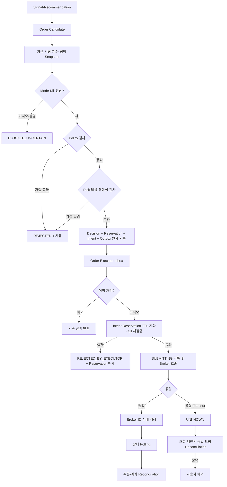

# 거래·주문·정책 시스템

## 핵심 원칙

- 추천은 분석 결과이며 주문 명령이 아니다.
- 정책·리스크 엔진이 통과시킨 실행 가능 객체만 Order Intent가 된다.
- AI가 매수 의견을 내도 정책·리스크가 거절하면 주문하지 않는다.
- 브로커가 실제로 허용하는 상태가 내부 캘린더보다 우선한다.
- 주문 결과가 불명확하면 상태를 `UNKNOWN`으로 두고 무조건 재주문하지 않는다.
- Kill Switch는 신규 주문 중단을 우선하며 자동 전량 청산을 기본 동작으로 삼지 않는다.

## 업무 객체 분리

| 객체 | 의미 | 생성 시점 |
|---|---|---|
| Strategy Signal | 결정론적 전략의 분석 결과 | 특징 계산 후 |
| Recommendation | 등급·근거·위험을 가진 분석 결과 | 전략·뉴스 분석 후 |
| Order Candidate | 정책·리스크 평가 대상 주문 후보 | 전략이 주문을 제안할 때 |
| Risk Decision | 정책·리스크의 규칙별 판정 Snapshot | Candidate 평가 시 |
| Risk Reservation | 승인된 Intent가 사용할 현금·매도수량·노출 한도의 예약 | Decision·Intent와 같은 DB 트랜잭션 |
| Order Intent | 실행 조건을 통과한 불변 주문 의도 | 승인 판정과 같은 DB 트랜잭션 |
| Broker Order | 브로커에 실제 제출된 주문 | Executor 제출 이후 |
| Fill Observation | 공식 API에서 관측한 체결 결과 | 주문 조회·Reconciliation 시 |

공식 API가 개별 체결 ID를 제공한다고 확인되면 `Broker Fill` 모델을 별도로 추가한다. 확인 전 내부 관측 ID를 브로커 체결 ID라고 표현하지 않는다.

## 상태 머신

### Order Candidate

```text
CREATED → EVALUATING → APPROVED
                    ↘ REJECTED
                    ↘ BLOCKED_UNCERTAIN
                    ↘ MANUAL_REVIEW_REQUIRED
                    ↘ EXPIRED
```

### Order Intent

```text
READY → DISPATCHED → ACCEPTED_BY_EXECUTOR
  │         └──────→ REJECTED_BY_EXECUTOR
  ├───────────────→ EXPIRED
  └───────────────→ CANCELED
```

Intent의 주문 속성과 승인 Snapshot은 불변이다. 상태 전이는 별도 이력으로 기록하며, `REJECTED_BY_EXECUTOR`는 브로커 호출 전에 재검증이 명확히 실패한 종결 상태다. 이 경우 Broker Order를 만들지 않는다.

### Risk Reservation

```text
ACTIVE → PARTIALLY_CONSUMED → CONSUMED
   ├───────────────────────→ RELEASED
   └───────────────────────→ EXPIRED
```

`UNKNOWN` Broker Order와 연결된 예약은 임의 해제하지 않는다. Reconciliation으로 브로커 제출·체결 여부가 확정된 뒤 소비하거나 해제한다.

### Broker Order

```text
SUBMITTING
  → PENDING
  → PARTIALLY_FILLED → FILLED
  → CANCEL_PENDING → CANCELED
  → REPLACE_PENDING → REPLACED
  → BROKER_REJECTED
  → UNKNOWN → RECONCILIATION_REQUIRED
```

내부 상태와 공식 브로커 상태는 별도 Enum으로 관리하고 Adapter에서 매핑한다. 알 수 없는 공식 상태는 안전한 종결 상태로 추측하지 않는다.

## 자동 주문 흐름



## 단일 주문 제출 경로

실제 브로커 제출로 이어지는 비동기 입력은 다음 한 경로만 허용한다.

```text
Trading Core Transactional Outbox
→ order.intent.v1 (key=account_id)
→ Order Executor Inbox
→ Broker Adapter
```

- `order.intent.v1`의 Producer는 Trading Core Outbox, Consumer는 Order Executor로 제한한다.
- Admin API, AI Agent, Airflow와 Dashboard는 Topic에 직접 주문 메시지를 발행할 수 없다.
- 승인형 거래도 승인 결과를 Trading Core에 전달하고, Core가 동일한 Outbox 경로로 발행한다.
- Executor는 Topic Payload의 주문 속성을 신뢰하지 않고 `order_intent_id`로 불변 Intent와 Reservation을 조회·검증한다.
- 주문 Topic은 운영자 승인 없이 Replay하거나 다른 Topic에서 자동 재발행하지 않는다.

## 멱등성과 중복 방지

다음 계층을 함께 사용한다.

1. `strategy_run_id`와 Signal identity로 동일 전략 신호 중복 방지
2. `order_candidate_id`와 업무 중복 키에 DB Unique Constraint
3. `order_intent_id`와 영구 내부 `idempotency_key`
4. Trading Core의 Transactional Outbox
5. Executor의 Inbox·처리 이력
6. 네트워크 호출 전 `SUBMITTING`과 요청 hash·시각 기록
7. 공식 `clientOrderId`에는 안정적인 내부 키를 사용
8. 브로커 주문 ID와 원본 응답 저장
9. 주문·체결·계좌 Reconciliation

공식 `clientOrderId` 보장 기간은 확인 당시 10분이다. 동일 요청의 제한된 재호출은 공식 보장 기간과 동일 본문 hash가 검증될 때만 고려한다. 기간이 지났거나 상태가 불명확하면 자동 재전송하지 않는다.

## 동시 주문과 자금·노출 예약

같은 계좌에서 여러 Candidate가 동시에 평가될 때 각각 같은 현금·매도수량·노출 여유를 사용하지 못하도록 계좌 단위 예약을 둔다.

- Risk 평가는 최신 계좌 Snapshot, 미체결 주문과 모든 `ACTIVE` Reservation을 포함한다.
- 승인 시 Risk Decision, Reservation, 불변 Order Intent와 Outbox를 하나의 PostgreSQL 트랜잭션으로 기록한다.
- 계좌·통화 단위 현금, 계좌·종목 단위 매도수량, 종목·섹터·일일 신규투자 한도를 예약한다.
- 같은 계좌의 승인 트랜잭션은 계좌 상태 행 잠금 또는 동등한 낙관적 Version 검사로 직렬화한다. 정확한 구현은 Contract 단계에서 정하되 충돌 시 재평가하고 불명확하면 거절한다.
- Kafka의 `account_id` Partition은 처리 순서를 보조할 뿐 예약의 Source of Truth가 아니다.
- 부분 체결은 해당 수량·금액만 소비하고 잔여 예약을 유지한다. 명확한 거절·취소·만료는 예약을 해제한다.
- `UNKNOWN`은 중복 제출 가능성이 해소될 때까지 예약을 유지하며 운영자가 수동으로 임의 해제하지 않는다.
- 브로커 미제출이 증명된 Intent 만료는 예약을 안전하게 해제한다. 제출 여부가 불명확한 만료·고아 Reservation은 감지·경보하고 Reconciliation 근거 없이 자동 해제하지 않는다.

## 주문 직전 재검증

Executor는 Intent ID만 받고 다음을 다시 검증한다.

- Intent 상태·서명/hash·만료 시각
- Trading Mode와 Kill Switch Stop Latch
- 승인된 정책 버전과 위험 판정 존재
- `ACTIVE` Reservation의 금액·수량·만료와 Intent 일치
- 계좌 Allowlist와 Credential 대상 계좌 일치
- 시장·세션·종목 주문 가능 상태
- 최신 가격과 Data Quality
- 매수 가능 금액·매도 가능 수량
- 내부 포지션과 최신 계좌 Snapshot의 정합성
- 미체결·연속 실패·동일 종목 주문 제한

이 검증 중 하나라도 실패하거나 조회 결과가 불명확하면 제출하지 않는다.

## 정책 버전 모델

```text
policy_id
policy_name
policy_type
policy_version
parameter_schema_version
parameters
effective_from / effective_to
status: DRAFT / REVIEWED / APPROVED / ACTIVE / RETIRED
changed_by / change_reason / approved_by
created_at / content_hash
```

정책은 자유로운 동적 코드가 아니라 타입이 있는 정책 구현과 검증된 파라미터로 구성한다. 파라미터는 코드에 흩어져 하드코딩하지 않지만, 안전 중요 계산 자체를 임의 DSL이나 AI에 맡기지 않는다.

충돌 우선순위는 다음과 같다.

```text
Global Stop
> Account·Market·Instrument Deny
> Data·Reconciliation Failure
> Exposure·Loss·Liquidity Limit
> Strategy Allow
```

동일 우선순위 충돌은 `DENY`가 우선하며 활성화 전 정적 충돌 검사를 수행한다.

## 정책·리스크 범위

| 그룹 | 규칙 |
|---|---|
| 자격 | 시장·자산 유형·종목·범주 Allowlist |
| 노출 | 종목 최대 비중, 섹터 최대 비중, 단일 주문 한도, 일일 신규 투자 한도, 최소 현금 |
| 손실 | 손절, 익절·추적손절 후보, 일일 최대 손실, 최대 낙폭 |
| 빈도 | 거래 횟수, 동일 종목 반복, 동일 신호 중복, 과도한 회전율 |
| 비용 | 예상 수수료·세금·환율·슬리피지, 기대수익 대비 비용 |
| 시장성 | 스프레드·유동성·최신 가격·거래 중단·시장 상태 |
| 계좌 | 미체결 수, 활성 예약, 연속 실패, 잔액·포지션·주문 정합성 |
| 뉴스 | 위험 임계치 이상 신규 매수 금지, 낮은 관련성·신뢰도 처리 |
| 시스템 | DB·Kafka·Executor·Audit·정책 로딩 상태 |

정확한 한도 수치는 [DECISIONS_PENDING.md](DECISIONS_PENDING.md)의 `TBD`다.

## 시장 캘린더와 세션

`MarketSessionProvider` 추상화를 두고 시장별 구현을 교체한다.

```text
market_country
exchange
exchange_timezone
business_date
session_type
session_start / session_end
holiday / early_close
trading_status
source / observed_at
```

고려할 상태는 휴장, 조기 폐장, 정규장, 프리마켓, 애프터마켓, 데이마켓, 거래 중단, 종목 정지, 공휴일, DST다.

내부 캘린더는 사전 판단과 설명에 사용한다. 최종 주문 허용은 최신 브로커 상태와 주문 가능 정보가 우선하며, 둘이 충돌하면 주문하지 않는다.

## Kill Switch

Kill Switch Scope는 다음과 같다.

- 신규 자동 주문 중단
- 미체결 주문 취소 요청
- AI Agent 실행 중단
- 자동에서 수동 모드 전환
- 특정 종목 중단
- 특정 전략 중단
- 전체 계좌 중단

STOP 명령은 인증된 직접 제어 경로와 영속 상태에 기록하고 Executor의 로컬 Stop Latch에 반영한다. Kafka는 상태 전파와 감사에 사용할 수 있지만 유일한 제어 경로가 아니다.

재활성화는 자동으로 수행하지 않으며, 원인·정합성·정책·데이터 상태를 확인하는 별도 절차가 필요하다. 미체결 취소는 최선 노력이며 취소 중 체결 가능성을 계속 추적한다.

자동 전량 청산은 별도 위험 정책과 승인 없이 구현하지 않는다.

## 사용자 예외

사용자 예외에는 다음을 포함한다.

- Signal·Candidate·Intent·Order 식별자
- 자동 처리되지 않은 이유와 규칙 결과
- 관련 데이터·정책·버전·근거
- 현재 위험도와 가능한 선택지
- 사용자가 조치하지 않을 때의 기본 동작
- 조치 가능 기한
- Audit·Trace 식별자

사용자 응답이 없을 때 기본 동작은 주문 보류 또는 만료이며 자동 승인으로 간주하지 않는다.
